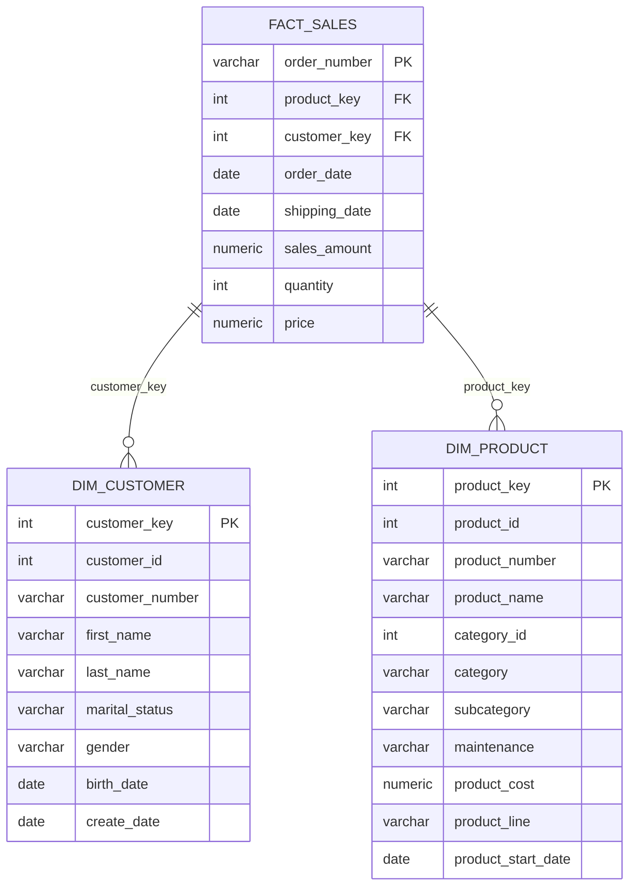

## Star Schema Design

The Gold layer implements a star schema - a dimensional modeling approach that organizes data into fact and dimension tables. This design pattern is optimized for analytical queries and business intelligence.

<Info>
  Star schemas are named for their visual appearance: a central fact table connected to multiple dimension tables, resembling a star.
</Info>

### Why Star Schema?

Star schemas provide several advantages for analytical workloads:

<CardGroup cols={2}>
  <Card title="Query Performance" icon="gauge-high">
    Denormalized structure minimizes joins and enables fast aggregation queries, improving dashboard and report performance.
  </Card>
  
  <Card title="Ease of Understanding" icon="brain">
    Business users can easily understand the model: facts represent business events, dimensions provide context.
  </Card>
  
  <Card title="Flexible Analysis" icon="sliders">
    Analysts can slice and dice facts by any combination of dimensions without complex SQL.
  </Card>
  
  <Card title="BI Tool Compatible" icon="chart-bar">
    Most BI tools are designed around star schemas, enabling drag-and-drop report building.
  </Card>
</CardGroup>

## Data Model Overview

The data warehouse implements a focused star schema centered on sales analysis:



## Fact Table

### fact_sales

The central fact table captures sales transactions with numeric measures and foreign keys to dimensions.

<AccordionGroup>
  <Accordion title="Table Purpose" icon="bullseye" defaultOpen>
    Records individual sales transactions with measures (amounts, quantities, prices) and links to customer and product dimensions for analysis.
  </Accordion>
  
  <Accordion title="Source Data" icon="database">
    Built from `silver.crm_sales_details` joined with dimension tables to resolve foreign keys.
  </Accordion>
</AccordionGroup>

#### Schema Definition

The fact table is implemented as a view in `~/workspace/source/scripts/gold/ddl_gold.sql`:

<CodeGroup>
```sql fact_sales View
create view gold.fact_sales as
select
    si.sls_ord_num as order_number,
    pr.product_key,
    cu.customer_key,
    si.sls_ord_dt as order_date,
    si.sls_ship_dt as shipping_date,
    si.sls_sales as sales_amount,
    si.sls_quantity as quantity,
    si.sls_price as price
from silver.crm_sales_details si
left join gold.dim_product pr
    on si.sls_prd_key = pr.product_number
left join gold.dim_customer cu
    on si.sls_cust_id = cu.customer_id;
```

```sql Example Query
-- Total sales by product category
SELECT 
    p.category,
    SUM(f.sales_amount) as total_sales,
    SUM(f.quantity) as total_units
FROM gold.fact_sales f
JOIN gold.dim_product p ON f.product_key = p.product_key
GROUP BY p.category
ORDER BY total_sales DESC;
```
</CodeGroup>

#### Column Reference

<Tabs>
  <Tab title="Keys & Identifiers">
    <ResponseField name="order_number" type="varchar" required>
      Unique identifier for the sales order. Primary key for the fact table.
    </ResponseField>
    
    <ResponseField name="product_key" type="integer" required>
      Foreign key to dim_product. Surrogate key for joining to product dimension.
    </ResponseField>
    
    <ResponseField name="customer_key" type="integer" required>
      Foreign key to dim_customer. Surrogate key for joining to customer dimension.
    </ResponseField>
  </Tab>
  
  <Tab title="Measures">
    <ResponseField name="sales_amount" type="numeric" required>
      Total sales value for the transaction in currency units. Primary revenue metric.
    </ResponseField>
    
    <ResponseField name="quantity" type="integer" required>
      Number of product units sold in the transaction. Volume metric for analysis.
    </ResponseField>
    
    <ResponseField name="price" type="numeric" required>
      Unit price for the product in this transaction. Enables price analysis and margin calculations.
    </ResponseField>
  </Tab>
  
  <Tab title="Dates">
    <ResponseField name="order_date" type="date" required>
      Date the order was placed. Primary time dimension for sales trend analysis.
    </ResponseField>
    
    <ResponseField name="shipping_date" type="date">
      Date the order was shipped. Enables fulfillment time analysis.
    </ResponseField>
  </Tab>
</Tabs>

<Tip>
  Use `order_date` for revenue recognition analysis and `shipping_date` for operational fulfillment metrics.
</Tip>

## Dimension Tables

Dimension tables provide descriptive attributes for filtering, grouping, and labeling fact table measures.

### dim_customer

Customer dimension for demographic and segmentation analysis.

<Accordion title="View Definition" defaultOpen>
```sql
create view gold.dim_customer as 
select 
    ROW_NUMBER() over (order by cst_id) as customer_key,
    ci.cst_id as customer_id,
    ci.cst_key as customer_number,
    ci.cst_firstname as first_name,
    ci.cst_lastname as last_name,
    ci.cst_marital_status as marital_status,
    case 
        when ci.cst_gndr !='n/a' then ci.cst_gndr 
        else coalesce(ca.gen, 'n/a') 
    end as gender,
    ca.bdate as birth_date,
    ci.cst_create_date as create_date
from silver.crm_cust_info ci
left join silver.erp_cust_az12 ca
    on ci.cst_key = ca.cid
left join silver.erp_loc_a101 la
    on ci.cst_key = la.cid;
```
</Accordion>

#### Customer Attributes

<Tabs>
  <Tab title="Identifiers" icon="fingerprint">
    <ResponseField name="customer_key" type="integer" required>
      Surrogate key generated by ROW_NUMBER(). Use this for joins to fact tables.
    </ResponseField>
    
    <ResponseField name="customer_id" type="integer" required>
      Natural key from source system. Use for data lineage and debugging.
    </ResponseField>
    
    <ResponseField name="customer_number" type="varchar" required>
      Business-friendly customer identifier displayed in reports.
    </ResponseField>
  </Tab>
  
  <Tab title="Demographics" icon="users">
    <ResponseField name="first_name" type="varchar" required>
      Customer first name for personalization and identification.
    </ResponseField>
    
    <ResponseField name="last_name" type="varchar" required>
      Customer last name for personalization and identification.
    </ResponseField>
    
    <ResponseField name="gender" type="varchar">
      Customer gender, with fallback logic from ERP when CRM value is 'n/a'. Used for demographic segmentation.
    </ResponseField>
    
    <ResponseField name="marital_status" type="varchar">
      Marital status for customer segmentation and targeted marketing.
    </ResponseField>
    
    <ResponseField name="birth_date" type="date">
      Customer birth date. Calculate age for demographic analysis and lifecycle marketing.
    </ResponseField>
  </Tab>
  
  <Tab title="Metadata" icon="clock">
    <ResponseField name="create_date" type="date">
      Date the customer record was created. Track customer acquisition and tenure.
    </ResponseField>
  </Tab>
</Tabs>

<Note>
  The gender field implements data quality logic: it uses the CRM value unless it's 'n/a', then falls back to the ERP source using COALESCE. See `gold/ddl_gold.sql:10-12`.
</Note>

### dim_product

Product dimension for product performance and category analysis.

<Accordion title="View Definition" defaultOpen>
```sql
create view gold.dim_product as
select
    row_number() over (order by pn.prd_start_dt, pn.prd_key) as product_key,
    pn.prd_id as product_id,
    pn.prd_key as product_number,
    pn.prd_name as product_name,
    pn.cat_id as category_id,
    pc.cat as category,
    pc.subcat as subcategory,
    pc.manteinance,
    pn.prd_cost as product_cost,
    pn.prd_line as product_line,
    pn.prd_start_dt as product_start_date
from silver.crm_prd_info pn
left join silver.erp_px_cat_g1v2 pc
    on pn.cat_id = pc.id
where pn.prd_end_dt is null;
```
</Accordion>

#### Product Attributes

<Tabs>
  <Tab title="Identifiers" icon="barcode">
    <ResponseField name="product_key" type="integer" required>
      Surrogate key generated by ROW_NUMBER(). Use this for joins to fact tables.
    </ResponseField>
    
    <ResponseField name="product_id" type="integer" required>
      Natural key from source system. Use for data lineage and debugging.
    </ResponseField>
    
    <ResponseField name="product_number" type="varchar" required>
      Business-friendly product identifier displayed in reports and catalogs.
    </ResponseField>
  </Tab>
  
  <Tab title="Product Details" icon="box">
    <ResponseField name="product_name" type="varchar" required>
      Descriptive product name for display in reports and analysis.
    </ResponseField>
    
    <ResponseField name="product_cost" type="numeric">
      Product cost for margin and profitability analysis.
    </ResponseField>
    
    <ResponseField name="product_line" type="varchar">
      Product line classification for portfolio analysis.
    </ResponseField>
    
    <ResponseField name="product_start_date" type="date">
      Date the product became available. Track product lifecycle and performance over time.
    </ResponseField>
  </Tab>
  
  <Tab title="Categories" icon="folder-tree">
    <ResponseField name="category_id" type="integer" required>
      Category identifier for joining to category hierarchies.
    </ResponseField>
    
    <ResponseField name="category" type="varchar">
      Top-level product category for high-level reporting and analysis.
    </ResponseField>
    
    <ResponseField name="subcategory" type="varchar">
      Detailed product subcategory for granular analysis and merchandising.
    </ResponseField>
    
    <ResponseField name="maintenance" type="varchar">
      Maintenance flag indicating if the product requires ongoing maintenance or support.
    </ResponseField>
  </Tab>
</Tabs>

<Warning>
  The dim_product view filters to only active products using `WHERE prd_end_dt IS NULL` (see `gold/ddl_gold.sql:41`). Discontinued products are excluded from the dimension.
</Warning>

## Analytical Use Cases

The star schema enables a wide range of analytical queries:

<AccordionGroup>
  <Accordion title="Customer Segmentation Analysis" icon="users-viewfinder">
    Analyze sales patterns by customer demographics:
    
    ```sql
    SELECT 
        c.gender,
        c.marital_status,
        COUNT(DISTINCT c.customer_key) as customer_count,
        SUM(f.sales_amount) as total_sales,
        AVG(f.sales_amount) as avg_order_value
    FROM gold.fact_sales f
    JOIN gold.dim_customer c ON f.customer_key = c.customer_key
    GROUP BY c.gender, c.marital_status
    ORDER BY total_sales DESC;
    ```
  </Accordion>
  
  <Accordion title="Product Performance Analysis" icon="chart-line">
    Track product and category performance metrics:
    
    ```sql
    SELECT 
        p.category,
        p.subcategory,
        COUNT(DISTINCT f.order_number) as order_count,
        SUM(f.quantity) as units_sold,
        SUM(f.sales_amount) as revenue,
        AVG(f.price) as avg_price
    FROM gold.fact_sales f
    JOIN gold.dim_product p ON f.product_key = p.product_key
    GROUP BY p.category, p.subcategory
    ORDER BY revenue DESC;
    ```
  </Accordion>
  
  <Accordion title="Sales Trends Over Time" icon="chart-column">
    Examine sales trends and seasonality:
    
    ```sql
    SELECT 
        DATE_TRUNC('month', f.order_date) as month,
        SUM(f.sales_amount) as monthly_sales,
        COUNT(DISTINCT f.order_number) as order_count,
        COUNT(DISTINCT f.customer_key) as unique_customers
    FROM gold.fact_sales f
    GROUP BY DATE_TRUNC('month', f.order_date)
    ORDER BY month;
    ```
  </Accordion>
  
  <Accordion title="Customer Lifetime Value" icon="sack-dollar">
    Calculate customer lifetime metrics:
    
    ```sql
    SELECT 
        c.customer_key,
        c.first_name || ' ' || c.last_name as customer_name,
        COUNT(f.order_number) as total_orders,
        SUM(f.sales_amount) as lifetime_value,
        AVG(f.sales_amount) as avg_order_value,
        MIN(f.order_date) as first_order_date,
        MAX(f.order_date) as last_order_date
    FROM gold.fact_sales f
    JOIN gold.dim_customer c ON f.customer_key = c.customer_key
    GROUP BY c.customer_key, c.first_name, c.last_name
    ORDER BY lifetime_value DESC
    LIMIT 100;
    ```
  </Accordion>
</AccordionGroup>

## Design Decisions

<Tabs>
  <Tab title="Surrogate Keys" icon="key">
    All dimension tables use surrogate keys (integer sequences) rather than natural keys:
    
    <Check>**Benefits**</Check>
    - Faster joins compared to multi-column or string natural keys
    - Insulates fact tables from changes to source system keys
    - Simplifies relationships and improves query performance
    - Enables consistent key type across all dimensions
    
    Natural keys (customer_id, product_id) are retained as attributes for lineage and debugging.
  </Tab>
  
  <Tab title="Views vs Tables" icon="table">
    Gold layer objects are implemented as views rather than materialized tables:
    
    <Info>**Rationale**</Info>
    - Simplifies ETL: no need to manage insert/update logic
    - Always reflects latest Silver layer data
    - Reduces storage requirements
    - Easier to modify and evolve as requirements change
    
    <Warning>**Consideration**</Warning>
    For very large datasets, consider materializing views as tables with scheduled refresh for better query performance.
  </Tab>
  
  <Tab title="Denormalization" icon="sitemap">
    Product categories are denormalized directly into dim_product:
    
    <Tip>**Why?**</Tip>
    - Eliminates additional joins for common queries
    - Category changes are infrequent, reducing update complexity
    - Improves query performance for category-based analysis
    - Simplifies query writing for analysts
    
    The trade-off is potential redundancy, but this is acceptable for analytical workloads prioritizing read performance.
  </Tab>
  
  <Tab title="Active Products Only" icon="filter">
    dim_product filters to active products only (no end date):
    
    <Check>**Benefits**</Check>
    - Focuses analysis on current product portfolio
    - Reduces dimension size and improves performance
    - Prevents historical products from cluttering reports
    
    <Note>**Historical Note**</Note>
    This design choice aligns with project requirements to focus on current state. For historical analysis across product lifecycles, you would need a Type 2 slowly changing dimension approach.
  </Tab>
</Tabs>

## Best Practices

<CardGroup cols={2}>
  <Card title="Always Join Through Keys" icon="link">
    Use surrogate keys (customer_key, product_key) for joins, not natural keys. This ensures optimal performance and consistency.
  </Card>
  
  <Card title="Filter Early" icon="filter">
    Apply filters on dimensions before joining to facts to reduce the working dataset and improve query performance.
  </Card>
  
  <Card title="Use Explicit Column Lists" icon="list">
    Always specify exact columns needed rather than SELECT *. This improves performance and makes queries self-documenting.
  </Card>
  
  <Card title="Leverage Aggregations" icon="calculator">
    Pre-aggregate fact measures (SUM, AVG, COUNT) at the grain needed for reporting to improve dashboard responsiveness.
  </Card>
</CardGroup>
