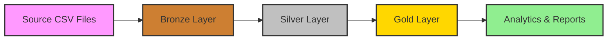

## What is Medallion Architecture?

The Medallion Architecture is a data design pattern that organizes data into three progressive layers - Bronze, Silver, and Gold. Each layer serves a specific purpose in the data refinement process, transforming raw source data into analytics-ready datasets.

<Info>
  The medallion pattern provides clear separation of concerns, making data lineage transparent and enabling teams to work at different layers simultaneously.
</Info>

## Architecture Layers

The three layers work together to progressively refine data quality and structure:

<Tabs>
  <Tab title="Bronze Layer" icon="1">
    ## Bronze Layer: Raw Data Ingestion
    
    The Bronze layer serves as the landing zone for raw data from source systems. Data is ingested with minimal transformation to preserve the original state.
    
    ### Characteristics
    
    <CardGroup cols={2}>
      <Card title="Raw Data Storage" icon="box-archive">
        Stores data exactly as received from ERP and CRM systems, maintaining complete fidelity to source systems.
      </Card>
      
      <Card title="Single Source of Truth" icon="fingerprint">
        Serves as the authoritative record of what was received from source systems, enabling data lineage tracking.
      </Card>
      
      <Card title="Minimal Transformation" icon="minimize">
        Only basic type conversions and schema validation are performed during ingestion from CSV files.
      </Card>
      
      <Card title="Data Preservation" icon="hard-drive">
        Maintains historical snapshots of source data for audit, debugging, and reprocessing scenarios.
      </Card>
    </CardGroup>
    
    ### Ingestion Process
    
    <Steps>
      <Step title="CSV File Reception">
        Source systems (ERP and CRM) export data as CSV files to a designated ingestion location.
      </Step>
      
      <Step title="Schema Validation">
        Validate that incoming CSV files match expected schema definitions before loading.
      </Step>
      
      <Step title="Data Loading">
        Load CSV data into PostgreSQL Bronze tables using COPY commands or ETL scripts.
      </Step>
      
      <Step title="Metadata Capture">
        Record ingestion timestamp, source file name, and row counts for tracking and auditing.
      </Step>
    </Steps>
    
    ### Data Sources
    
    <Accordion title="ERP System Data" icon="building" defaultOpen>
      Customer demographic data, product categories, and location information:
      - Customer profiles with birth dates and gender
      - Product categorization and maintenance flags
      - Geographic location mappings
    </Accordion>
    
    <Accordion title="CRM System Data" icon="users">
      Customer interactions, product details, and sales transactions:
      - Customer contact information and preferences
      - Product catalog with pricing and lifecycle dates
      - Sales order details with quantities and amounts
    </Accordion>
    
    <Warning>
      Bronze layer data may contain quality issues, duplicates, and inconsistencies inherited from source systems. Never query Bronze tables directly for analytics.
    </Warning>
  </Tab>
  
  <Tab title="Silver Layer" icon="2">
    ## Silver Layer: Cleansing & Standardization
    
    The Silver layer transforms raw Bronze data into cleaned, standardized, and validated datasets ready for business modeling.
    
    ### Transformation Activities
    
    <AccordionGroup>
      <Accordion title="Data Cleansing" icon="broom" defaultOpen>
        Remove or correct data quality issues:
        - Handle null values and missing data appropriately
        - Correct invalid or out-of-range values
        - Standardize text fields (trim whitespace, fix casing)
        - Remove or flag corrupted records
      </Accordion>
      
      <Accordion title="Standardization" icon="arrows-to-circle">
        Apply consistent formats and conventions:
        - Standardize date and timestamp formats
        - Normalize naming conventions across sources
        - Apply standard code mappings and lookups
        - Convert to canonical data types
      </Accordion>
      
      <Accordion title="Normalization" icon="table-cells">
        Structure data for consistency:
        - Remove redundant data and duplicates
        - Split combined fields into atomic elements
        - Apply referential integrity rules
        - Ensure consistent granularity
      </Accordion>
      
      <Accordion title="Data Validation" icon="circle-check">
        Verify data quality and business rules:
        - Check referential integrity across tables
        - Validate business rule constraints
        - Flag anomalies for investigation
        - Generate data quality metrics
      </Accordion>
    </AccordionGroup>
    
    ### Silver Tables
    
    The Silver layer contains cleaned versions of Bronze tables:
    
    - `silver.crm_cust_info` - Standardized customer information from CRM
    - `silver.crm_prd_info` - Cleansed product catalog from CRM
    - `silver.crm_sales_details` - Validated sales transactions
    - `silver.erp_cust_az12` - Customer demographics from ERP
    - `silver.erp_px_cat_g1v2` - Product categorization from ERP
    - `silver.erp_loc_a101` - Location data from ERP
    
    <Tip>
      Silver tables use consistent naming conventions and data types, making them easier to join and query compared to Bronze tables.
    </Tip>
    
    ### Quality Improvements
    
    Examples of quality enhancements in the Silver layer:
    
    <CodeGroup>
      ```sql Gender Standardization
      -- Handle missing gender by falling back to ERP source
      CASE 
        WHEN crm.cst_gndr != 'n/a' THEN crm.cst_gndr 
        ELSE COALESCE(erp.gen, 'n/a') 
      END AS gender
      ```
      
      ```sql Active Product Filter
      -- Filter to only active products (no end date)
      WHERE prd_end_dt IS NULL
      ```
      
      ```sql Duplicate Removal
      -- Use ROW_NUMBER to deduplicate records
      ROW_NUMBER() OVER (PARTITION BY customer_id ORDER BY update_date DESC) AS rn
      WHERE rn = 1
      ```
    </CodeGroup>
  </Tab>
  
  <Tab title="Gold Layer" icon="3">
    ## Gold Layer: Business-Ready Analytics
    
    The Gold layer contains curated, business-focused datasets modeled for analytical queries and reporting. Data is organized in a star schema with fact and dimension tables.
    
    ### Purpose and Benefits
    
    <CardGroup cols={2}>
      <Card title="Optimized for Analytics" icon="magnifying-glass-chart">
        Star schema design enables fast, intuitive queries for common business questions.
      </Card>
      
      <Card title="Business Terminology" icon="briefcase">
        Uses business-friendly names and structures that analysts and stakeholders understand.
      </Card>
      
      <Card title="Pre-Joined Data" icon="link">
        Dimension and fact tables are pre-modeled to simplify query complexity.
      </Card>
      
      <Card title="Performance Optimized" icon="rocket">
        Denormalized structure reduces join complexity and improves query performance.
      </Card>
    </CardGroup>
    
    ### Star Schema Components
    
    <Accordion title="Fact Tables" icon="table" defaultOpen>
      Central tables containing business metrics and foreign keys to dimensions:
      
      **fact_sales**: Sales transactions with measures and dimension references
      - Measures: sales_amount, quantity, price
      - Dimensions: customer_key, product_key, order_date, shipping_date
      
      Fact tables answer questions like "What were total sales?" and "How many units sold?"
    </Accordion>
    
    <Accordion title="Dimension Tables" icon="table-list">
      Descriptive attributes that provide context for analyzing facts:
      
      **dim_customer**: Customer attributes for segmentation and analysis
      - Demographics: gender, marital_status, birth_date
      - Identifiers: customer_number, first_name, last_name
      
      **dim_product**: Product attributes for performance analysis
      - Product details: product_name, category, subcategory
      - Attributes: product_cost, product_line, maintenance flag
      
      Dimensions answer "Who?", "What?", and "Where?" questions about business events.
    </Accordion>
    
    ### Analytical Capabilities
    
    The Gold layer enables powerful analytical queries:
    
    <Steps>
      <Step title="Customer Analytics">
        Analyze customer behavior, segmentation, and lifetime value using dim_customer attributes combined with sales facts.
      </Step>
      
      <Step title="Product Performance">
        Track product sales, profitability, and category performance using dim_product joined with fact_sales.
      </Step>
      
      <Step title="Sales Trends">
        Examine sales patterns over time, seasonal trends, and growth metrics using date dimensions and sales aggregations.
      </Step>
      
      <Step title="Cross-Dimensional Analysis">
        Combine multiple dimensions to answer complex questions like "Which customer segments buy which product categories?"
      </Step>
    </Steps>
    
    <Check>
      The Gold layer is the primary interface for BI tools, SQL analysts, and reporting applications. All analytics should query Gold tables.
    </Check>
  </Tab>
</Tabs>

## Layer Comparison

Understanding the differences between layers helps determine where to focus efforts:

| Aspect | Bronze | Silver | Gold |
|--------|--------|--------|------|
| **Purpose** | Raw data preservation | Data cleansing & prep | Analytics & reporting |
| **Data Quality** | As-is from source | Validated & cleaned | Business-ready |
| **Structure** | Source system schemas | Normalized tables | Star schema (denormalized) |
| **Users** | Data engineers | Data engineers | Analysts, BI tools |
| **Queryable** | For debugging only | Yes, for ETL | Primary analytics interface |
| **Naming** | Source system names | Standardized technical | Business-friendly |

## Data Flow Between Layers

Data progresses through the layers in a controlled pipeline:



<Note>
  Each layer transformation is implemented as SQL scripts and views in the `/workspace/source/scripts/` directory, organized by layer.
</Note>

## Best Practices

<AccordionGroup>
  <Accordion title="Always Preserve Bronze Data" icon="database">
    Never delete or modify Bronze layer data. It serves as your source of truth for reprocessing and debugging.
  </Accordion>
  
  <Accordion title="Document Transformations" icon="file-lines">
    Clearly document all transformations between layers, including business logic and data quality rules.
  </Accordion>
  
  <Accordion title="Test at Each Layer" icon="vial">
    Implement data quality tests at Silver and Gold layers to catch issues before they reach analytics.
  </Accordion>
  
  <Accordion title="Use Appropriate Layer for Task" icon="bullseye">
    Query Bronze for debugging, Silver for ETL development, and Gold for all analytics and reporting.
  </Accordion>
</AccordionGroup>
