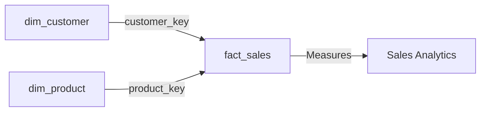

The Gold layer represents the final stage of the data warehouse pipeline, providing business-ready analytics models organized in a star schema. This layer is optimized for reporting, dashboards, and data analysis.

## Purpose

The Gold layer delivers:

<CardGroup cols={2}>
  <Card title="Star Schema" icon="star">
    Dimensional model optimized for analytics queries
  </Card>
  <Card title="Business Context" icon="briefcase">
    Data enriched with business meaning and relationships
  </Card>
  <Card title="Query Performance" icon="gauge-high">
    Denormalized structures for fast query response
  </Card>
  <Card title="Self-Service Analytics" icon="chart-line">
    Easy-to-understand models for business users
  </Card>
</CardGroup>

## Star Schema Architecture

The Gold layer implements a classic star schema with one fact table and two dimension tables:



<Info>
  The star schema design allows for simple, efficient joins and intuitive query patterns for business analysts.
</Info>

## Dimension Tables

### dim_customer

Provides a 360-degree view of customers by combining CRM and ERP data sources.

```sql
CREATE VIEW gold.dim_customer AS 
SELECT 
    ROW_NUMBER() OVER (ORDER BY cst_id) as customer_key,
    ci.cst_id as customer_id,
    ci.cst_key as customer_number,
    ci.cst_firstname as first_name,
    ci.cst_lastname as last_name,
    ci.cst_marital_status as marital_status,
    CASE 
        WHEN ci.cst_gndr != 'n/a' THEN ci.cst_gndr 
        ELSE coalesce(ca.gen, 'n/a') 
    END as gender,
    ca.bdate as birth_date,
    ci.cst_create_date as create_date
FROM silver.crm_cust_info ci
LEFT JOIN silver.erp_cust_az12 ca
    ON ci.cst_key = ca.cid
LEFT JOIN silver.erp_loc_a101 la
    ON ci.cst_key = la.cid;
```

<AccordionGroup>
  <Accordion title="Customer Attributes" icon="user">
    **Key Fields:**
    - `customer_key`: Surrogate key for dimension
    - `customer_id`: Natural key from source system
    - `customer_number`: Business key for customer lookup
    - `first_name`, `last_name`: Customer name attributes
    - `marital_status`: Single, Married, or n/a
    - `gender`: Male, Female, or n/a (with ERP fallback)
    - `birth_date`: Date of birth from ERP system
    - `create_date`: Customer creation date in CRM
  </Accordion>

  <Accordion title="Data Integration" icon="code-merge">
    This dimension integrates data from three Silver tables:
    
    - **silver.crm_cust_info**: Primary customer attributes
    - **silver.erp_cust_az12**: Birth date and gender (fallback)
    - **silver.erp_loc_a101**: Location information
    
    <Note>
      Gender is sourced from CRM, with ERP data used as fallback when CRM has 'n/a'.
    </Note>
  </Accordion>

  <Accordion title="Surrogate Key" icon="key">
    Uses `ROW_NUMBER()` to generate a sequential surrogate key:
    
    ```sql
    ROW_NUMBER() OVER (ORDER BY cst_id) as customer_key
    ```
    
    This provides a stable, integer key for fact table joins.
  </Accordion>
</AccordionGroup>

### dim_product

Provides comprehensive product information with category hierarchy.

```sql
CREATE VIEW gold.dim_product AS
SELECT
    ROW_NUMBER() OVER (
        ORDER BY pn.prd_start_dt, pn.prd_key
    ) as product_key,
    pn.prd_id as product_id,
    pn.prd_key as product_number,
    pn.prd_name as product_name,
    pn.cat_id as category_id,
    pc.cat as category,
    pc.subcat as subcategory,
    pc.manteinance,
    pn.prd_cost as product_cost,
    pn.prd_line as product_line,
    pn.prd_start_dt as product_start_date
FROM silver.crm_prd_info pn
LEFT JOIN silver.erp_px_cat_g1v2 pc
    ON pn.cat_id = pc.id
WHERE pn.prd_end_dt IS NULL;
```

<AccordionGroup>
  <Accordion title="Product Attributes" icon="box">
    **Key Fields:**
    - `product_key`: Surrogate key for dimension
    - `product_id`: Natural key from source system
    - `product_number`: Business key for product lookup
    - `product_name`: Product name/description
    - `category_id`: Category identifier
    - `category`: Product category (e.g., Bikes, Accessories)
    - `subcategory`: Product subcategory for detailed grouping
    - `manteinance`: Maintenance classification
    - `product_cost`: Standard cost of product
    - `product_line`: Mountain, Road, Touring, Other sales
    - `product_start_date`: Product effective date
  </Accordion>

  <Accordion title="Category Hierarchy" icon="sitemap">
    Product categorization is enriched from ERP data:
    
    ```
    category_id → category → subcategory
    ```
    
    This enables drill-down analysis from category to subcategory to individual products.
  </Accordion>

  <Accordion title="Active Products Filter" icon="filter">
    The dimension only includes currently active products:
    
    ```sql
    WHERE pn.prd_end_dt IS NULL
    ```
    
    <Warning>
      Historical products with end dates are excluded from this view. Consider creating a separate view for historical product analysis.
    </Warning>
  </Accordion>

  <Accordion title="Surrogate Key" icon="key">
    Uses `ROW_NUMBER()` ordered by start date and product key:
    
    ```sql
    ROW_NUMBER() OVER (
        ORDER BY pn.prd_start_dt, pn.prd_key
    ) as product_key
    ```
  </Accordion>
</AccordionGroup>

## Fact Table

### fact_sales

Contains sales transactions with foreign keys to dimension tables.

```sql
CREATE VIEW gold.fact_sales AS
SELECT
    si.sls_ord_num as order_number,
    pr.product_key,
    cu.customer_key,
    si.sls_ord_dt as order_date,
    si.sls_ship_dt as shipphing_date,
    si.sls_sales as sales_amount,
    si.sls_quantity as quantity,
    si.sls_price as price
FROM silver.crm_sales_details si
LEFT JOIN gold.dim_product pr
    ON si.sls_prd_key = pr.product_number
LEFT JOIN gold.dim_customer cu
    ON si.sls_cust_id = cu.customer_id;
```

<AccordionGroup>
  <Accordion title="Fact Attributes" icon="table">
    **Key Fields:**
    - `order_number`: Sales order identifier (degenerate dimension)
    - `product_key`: Foreign key to dim_product
    - `customer_key`: Foreign key to dim_customer
    - `order_date`: Date order was placed
    - `shipphing_date`: Date order was shipped
    
    **Measures:**
    - `sales_amount`: Total sales value
    - `quantity`: Number of units sold
    - `price`: Unit price
  </Accordion>

  <Accordion title="Grain" icon="magnifying-glass">
    The grain of the fact table is:
    
    <Note>
      **One row per order line item** - Each row represents a single product on a sales order.
    </Note>
    
    This allows analysis at the order line level with the ability to aggregate to order or customer level.
  </Accordion>

  <Accordion title="Measures & Calculations" icon="calculator">
    The fact table provides these measure types:
    
    <Tabs>
      <Tab title="Additive">
        These measures can be summed across all dimensions:
        - `sales_amount`: Total revenue
        - `quantity`: Total units sold
      </Tab>
      
      <Tab title="Semi-Additive">
        These measures can be summed across some dimensions:
        - `price`: Can be averaged but not summed
      </Tab>
      
      <Tab title="Derived">
        Calculate additional measures:
        ```sql
        -- Average selling price
        sales_amount / quantity AS avg_price
        
        -- Price variance from standard cost
        price - product_cost AS price_variance
        ```
      </Tab>
    </Tabs>
  </Accordion>

  <Accordion title="Dimension Joins" icon="link">
    Fact table uses LEFT JOINs to dimensions:
    
    ```sql
    LEFT JOIN gold.dim_product pr
        ON si.sls_prd_key = pr.product_number
    LEFT JOIN gold.dim_customer cu
        ON si.sls_cust_id = cu.customer_id
    ```
    
    <Warning>
      LEFT JOINs preserve all sales transactions even if dimension lookups fail. Monitor for NULL dimension keys which indicate orphaned transactions.
    </Warning>
  </Accordion>
</AccordionGroup>

## Analytics Use Cases

<Tabs>
  <Tab title="Sales by Product Line">
    ```sql
    SELECT 
        p.product_line,
        p.category,
        SUM(f.sales_amount) as total_sales,
        SUM(f.quantity) as total_units,
        COUNT(DISTINCT f.order_number) as order_count
    FROM gold.fact_sales f
    INNER JOIN gold.dim_product p 
        ON f.product_key = p.product_key
    GROUP BY p.product_line, p.category
    ORDER BY total_sales DESC;
    ```
  </Tab>
  
  <Tab title="Customer Demographics">
    ```sql
    SELECT 
        c.gender,
        c.marital_status,
        COUNT(DISTINCT c.customer_key) as customer_count,
        SUM(f.sales_amount) as total_sales,
        AVG(f.sales_amount) as avg_order_value
    FROM gold.fact_sales f
    INNER JOIN gold.dim_customer c 
        ON f.customer_key = c.customer_key
    GROUP BY c.gender, c.marital_status
    ORDER BY total_sales DESC;
    ```
  </Tab>
  
  <Tab title="Monthly Sales Trends">
    ```sql
    SELECT 
        DATE_TRUNC('month', f.order_date) as month,
        SUM(f.sales_amount) as monthly_sales,
        COUNT(DISTINCT f.customer_key) as active_customers,
        COUNT(DISTINCT f.order_number) as order_count
    FROM gold.fact_sales f
    WHERE f.order_date >= CURRENT_DATE - INTERVAL '12 months'
    GROUP BY DATE_TRUNC('month', f.order_date)
    ORDER BY month;
    ```
  </Tab>
  
  <Tab title="Product Performance">
    ```sql
    SELECT 
        p.product_name,
        p.category,
        p.subcategory,
        SUM(f.quantity) as units_sold,
        SUM(f.sales_amount) as revenue,
        SUM(f.quantity * p.product_cost) as cost,
        SUM(f.sales_amount - f.quantity * p.product_cost) as profit
    FROM gold.fact_sales f
    INNER JOIN gold.dim_product p 
        ON f.product_key = p.product_key
    GROUP BY p.product_name, p.category, p.subcategory
    HAVING SUM(f.quantity) > 10
    ORDER BY profit DESC
    LIMIT 20;
    ```
  </Tab>
</Tabs>

## Data Refresh

Gold layer views are automatically refreshed when queried since they're based on Silver tables:

<Steps>
  <Step title="Load Bronze Layer">
    ```sql
    CALL bronze.load_bronze();
    ```
  </Step>
  
  <Step title="Load Silver Layer">
    ```sql
    CALL silver.load_silver();
    ```
  </Step>
  
  <Step title="Query Gold Views">
    Views automatically reflect latest Silver data:
    ```sql
    SELECT * FROM gold.fact_sales;
    ```
  </Step>
</Steps>

<Note>
  Gold views are not materialized, so they always show current data from Silver tables. For better performance on large datasets, consider materializing these views.
</Note>

## Best Practices

<CardGroup cols={2}>
  <Card title="Always Join on Keys" icon="link">
    Use surrogate keys (customer_key, product_key) for joins, not natural keys
  </Card>
  
  <Card title="Filter Early" icon="filter">
    Apply date filters before joining to reduce dataset size
  </Card>
  
  <Card title="Index Dimensions" icon="database">
    Consider indexing frequently filtered dimension attributes
  </Card>
  
  <Card title="Monitor Orphans" icon="triangle-exclamation">
    Check for NULL dimension keys in fact table
  </Card>
</CardGroup>

## Next Steps

<CardGroup cols={2}>
  <Card title="ETL Procedures" icon="gears" href="/pipeline/etl-procedures">
    Learn how to orchestrate the complete pipeline
  </Card>
  <Card title="Silver Layer" icon="database" href="/pipeline/silver-layer">
    Understand data transformations feeding Gold layer
  </Card>
</CardGroup>