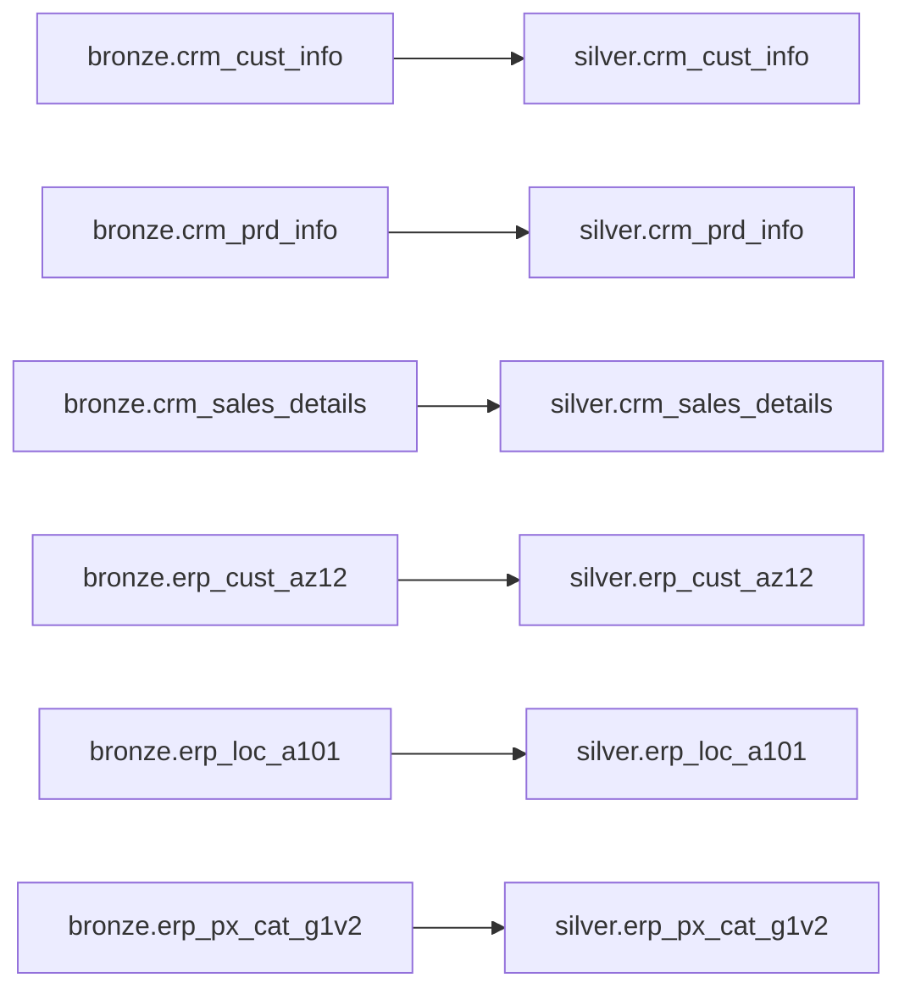

## Procedure Signature

```sql
silver.load_silver()
```

**Returns:** void

**Language:** PL/pgSQL

**Security:** SECURITY DEFINER

## Purpose and Functionality

The `silver.load_silver()` procedure transforms and cleanses raw data from the bronze layer into curated, business-ready data in the silver layer. This is the second stage of the data warehouse ETL pipeline, where data quality improvements and standardization are applied.

Key responsibilities:
- Data cleansing and standardization
- Removing duplicates and handling nulls
- Transforming coded values into human-readable formats
- Applying business rules and validations
- Type conversions and data formatting

## Key Transformations Applied

### CRM Customer Information (`silver.crm_cust_info`)

<CodeGroup>
```sql Deduplication
-- Keep only the most recent record per customer
ROW_NUMBER() OVER (PARTITION BY cst_id ORDER BY cst_create_date DESC) AS flag_last
WHERE flag_last = 1
```

```sql Data Cleaning
-- Trim whitespace from text fields
trim(cst_key)
trim(cst_firstname)
trim(cst_lastname)

-- Standardize marital status codes
case upper(trim(cst_marital_status)) 
  WHEN 'S' THEN 'Single' 
  WHEN 'M' THEN 'Married' 
  else 'n/a'
END

-- Standardize gender codes
case upper(trim(cst_gndr)) 
  WHEN 'M' THEN 'Male' 
  WHEN 'F' THEN 'Female' 
  else 'n/a'
END
```
</CodeGroup>

### CRM Product Information (`silver.crm_prd_info`)

<CodeGroup>
```sql Category Extraction
-- Extract category ID from product key
replace(substring(trim(prd_key), 1, 5), '-','_') as cat_id
substring(prd_key, 7, length(prd_key)) as prd_key
```

```sql Data Cleaning
-- Handle null costs
coalesce(prd_cost, 0) as prd_cost

-- Expand product line codes
case upper(trim(prd_line))
  when 'M' then 'Mountain'
  when 'R' then 'Road'
  when 'S' then 'Other sales'
  when 'T' then 'Touring'
  else 'n/a'
end as prd_line

-- Calculate end dates using window function
lead(prd_start_dt) over (partition by prd_key order by prd_start_dt)-1 as prd_end_dt
```
</CodeGroup>

### CRM Sales Details (`silver.crm_sales_details`)

<CodeGroup>
```sql Date Validation
-- Validate and convert date fields
CASE
  WHEN sls_ord_dt IS NULL OR sls_ord_dt = 0 OR length(sls_ord_dt::text) != 8
  THEN NULL
  ELSE to_date(TRIM(sls_ord_dt::text), 'YYYYMMDD')
END AS sls_ord_dt
```

```sql Sales Amount Correction
-- Recalculate sales if invalid
case 
  when sls_sales is null 
    or sls_sales <= 0 
    or sls_sales != sls_quantity * abs(sls_price) 
  then sls_quantity * abs(sls_price)
  else sls_sales
end as sls_sales
```

```sql Price Correction
-- Fix negative or null prices
case 
  when sls_price is null or sls_price = 0 
  then sls_sales / abs(sls_quantity)
  when sls_price < 0 
  then abs(sls_price)
  else sls_price
end as sls_price
```
</CodeGroup>

### ERP Customer Data (`silver.erp_cust_az12`)

<CodeGroup>
```sql ID Cleaning
-- Remove 'NAS' prefix from customer IDs
case 
  when cid like 'NAS%' then substring(cid, 4, length(cid))
  else cid
end as cid
```

```sql Date Validation
-- Reject future birthdates
case 
  when bdate > current_date then null
  else bdate
end as bdate
```

```sql Gender Standardization
-- Standardize gender values
case 
  when upper(trim(gen)) in ('F', 'FEMALE') then 'Female'
  when upper(trim(gen)) in ('M', 'MALE') then 'Male'
  else 'n/a'
end as gen
```
</CodeGroup>

### ERP Location Data (`silver.erp_loc_a101`)

<CodeGroup>
```sql ID Cleaning
-- Remove dashes from customer IDs
replace(cid, '-', '') as cid
```

```sql Country Standardization
-- Expand country codes
case 
  when trim(cntry) in ('USA','US') then 'United States'
  when trim(cntry) = 'CAN' then 'Canada'
  when trim(cntry) = 'DE' then 'Germany'
  when trim(cntry) = '' or trim(cntry) is null then 'n/a'
  else trim(cntry)
end as cntry
```
</CodeGroup>

### ERP Product Category Data (`silver.erp_px_cat_g1v2`)

```sql
-- Direct copy with no transformations
insert into silver.erp_px_cat_g1v2 (id, cat, subcat, manteinance)
select id, cat, subcat, manteinance
from bronze.erp_px_cat_g1v2;
```

## Steps Performed

<Steps>
  <Step title="Transform CRM Customer Information">
    Load `silver.crm_cust_info` with deduplication, text trimming, and code expansion for marital status and gender
  </Step>
  
  <Step title="Transform CRM Product Information">
    Load `silver.crm_prd_info` with category extraction, null handling, product line expansion, and end date calculation
  </Step>
  
  <Step title="Transform CRM Sales Details">
    Load `silver.crm_sales_details` with date validation, sales amount correction, and price validation
  </Step>
  
  <Step title="Clean ERP Customer Data">
    Load `silver.erp_cust_az12` with ID prefix removal, birthdate validation, and gender standardization
  </Step>
  
  <Step title="Clean ERP Location Data">
    Load `silver.erp_loc_a101` with ID formatting and country code expansion
  </Step>
  
  <Step title="Load ERP Product Category Data">
    Load `silver.erp_px_cat_g1v2` with direct copy (no transformations needed)
  </Step>
</Steps>

## Usage Example

```sql
CALL silver.load_silver();
```

**Expected Output:**
```
NOTICE:  [16:35:12] load silver started
NOTICE:  Step [load silver.crm_cust_info] completed successfully (3 s)
NOTICE:  Step [load silver.crm_prd_info] completed successfully (2 s)
NOTICE:  Step [load silver.crm_sales_details] completed successfully (4 s)
NOTICE:  Step [load silver.erp_cust_az12] completed successfully (1 s)
NOTICE:  Step [load silver.erp_loc_a101] completed successfully (1 s)
NOTICE:  Step [load silver.erp_px_cat_g1v2] completed successfully (1 s)
NOTICE:  load silver finished in [12] seconds
NOTICE:  [16:35:24] load silver started
```

## Prerequisites

<Warning>
The bronze layer must be loaded first before running this procedure:

```sql
CALL bronze.load_bronze();
CALL silver.load_silver();
```
</Warning>

## Error Handling

<Note>
The procedure implements robust error handling at each transformation step:
</Note>

- **Step-level Exception Handling**: Each table transformation is isolated with its own error handler
- **Descriptive Error Messages**: Errors include the step name and PostgreSQL error details
- **Fail-Fast Behavior**: Execution halts immediately upon encountering an error
- **Performance Metrics**: Each step logs execution time for monitoring
- **Success Tracking**: Counter variables track successful (`v_ok`) and failed (`v_err`) operations

<Warning>
If any transformation step fails, the procedure raises an exception:

```
Error in step: [step_name] - [error_details]
```

All subsequent steps are skipped to maintain data consistency.
</Warning>

## Data Quality Rules

The procedure enforces several data quality rules:

| Rule Type | Description | Example |
|-----------|-------------|----------|
| **Deduplication** | Keep only latest records | CRM customer info by create date |
| **Null Handling** | Replace nulls with defaults | Product cost defaults to 0 |
| **Date Validation** | Reject invalid dates | Future birthdates become NULL |
| **Value Standardization** | Expand codes to full names | 'M' → 'Male', 'S' → 'Single' |
| **ID Formatting** | Remove unwanted characters | Remove 'NAS' prefix, dashes |
| **Calculated Fields** | Derive values from other columns | Sales = Quantity × Price |
| **Type Conversion** | Convert string dates to DATE type | '20240101' → 2024-01-01 |

## Permissions

The procedure grants the following permissions:

```sql
GRANT EXECUTE ON PROCEDURE silver.load_silver() TO PUBLIC;
GRANT USAGE ON SCHEMA silver TO PUBLIC;
GRANT SELECT ON ALL TABLES IN SCHEMA silver TO PUBLIC;
```

## Data Flow


